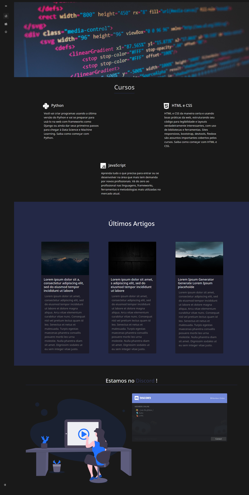

#  <h1 style="align=center">**Cyberzone**</h1>

## Bem vindo ao mundo **Cyberzone**.  
#### *Devido a demanda por sites de TI estar aumentando nos últimos anos, Cyberzone é uma iniciativa de João Vitor Waldrich, Maria Vitória Machado e Vitor Ehrig junto ao programa Entra21 de desenvolver um site com a missão de levar a esta demanda uma aplicação com uma interface simples e intuitiva de utilizar, uma aplicação cujo o objetivo é atrair o público que deseja aprender ou ensinar mais sobre a área de informática.*

## Deseja dar uma olhada na nossa tela inicial?

---

### **_Temos uma tela de perfil para você customizar do seu jeito, pois possui a opção de trocar o background, a foto de perfil ou acrescentar uma biografia que você desejar. Além disso, você pode olhar todos os artigos postados por você!_**

----

---

### **_Caso você queira pode dar uma olhada nos artigos de outros membros da comunidade, fique a vontade, junto fazemos o mundo de TI um local mais acessivel a todos!_**

---

---

### **Utilizamos o framework Django, o site atualmente suporta a modificação de perfil e criação de artigos como base de seu escopo, mas nada impede de haver atualizações em seu futuro.**

# **Instalação**

## **Automática**

-> Execute o script `main.py` que esta na pagina principal

---

## **Manual**

- #### Windows
  - *Instale as dependências*
    - `pip install -r requirements.txt --no-dependencies`
  - *Rode o servidor*
    - `python src/manage.py runserver`

- #### Arch Linux
  - `pip install -r requirements.txt --no-dependencies; python src/manage.py runserver`
- #### Debian Based Distro
  - `pip install -r requirements.txt --no-dependencies; python3 src/manage.py runserver`

---